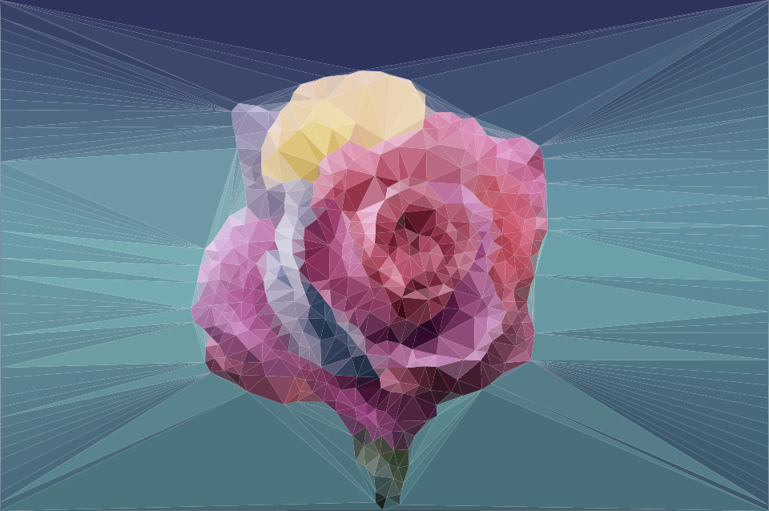

# PLYGN

PLYGN converts your images into low poly artworks! It was a free time project of mine and is open source so that people can extract certain code elements they might need.
Feel free to take it apart!

How does PLYGN work?
===
When the image at the location the user specified in the program arguments is loaded, either one of the **edge detection filters** is applied to a clone of the original image after converting it to grayscale. 
When the kernel value of the filter exceeds a threshold value when applied to a collections of pixels, the corresponding position is noted. 
After applying the filter to the whole image, a set of two-dimensional vectors within the boundaries of the image is known which (partially) can be used to triangulate the image. These vectors are the vertices of the **triangles**. 
In most cases this set is too large to produce satisfying results since the triangles would be extremely small, especially when their vertices are directly positioned next to each other in the image. 
Sometimes images with a **similar triangle count** are wanted and therefore a **vertex count** must be specified. When the **vector cloud** used to triangulate the image is determined, the same amount of vectors gets randomly distributed across the image. Then, the closest vectors, with its pixel value exceeding the filtering threshold, to each of the randomized vectors is added to the vector cloud if its distance to any other previously computed vector cloud element is greater than a given threshold value. 
The **"Delaunay algorithm"** is then used to produce an array of triangles that cover the whole image and do not overlap using the previously computed vector cloud. 
During the last step, the **most dominant color** in each of the triangles is determined and then the triangles are tinted with it before exporting the final result. When using the **clustering option**, all colors are transferred into a three dimensional cube and then the most dominant color is found using the **k-means clustering algorithm**. If the unclustered option is used, the extracted colors are transferred into a **color histogram** which is then sorted in descending order in the amount of **absolute color occurences**.

How do I use PLYGN?
===
PLYGN is written in Java without any libraries other than Java's standard library.
Hence, you can grab the project files and compile it yourself.

The result of the process depends on multiple parameters which can be inserted as program parameters:

&nbsp;&nbsp;&nbsp;&nbsp;&nbsp;  `-vertexMinimumDistance|-vmd = \<value\>`  
&nbsp;&nbsp;&nbsp;&nbsp;&nbsp;&nbsp;    Vectors that could be part of the vector cloud used to build the triangles have to maintain a minimum distance to  &nbsp;&nbsp;&nbsp;&nbsp;&nbsp;&nbsp;&nbsp;each other because otherwise the triangles tend to be squishy  
&nbsp;&nbsp;&nbsp;&nbsp;&nbsp;  `-vertexMaximumCount|-vmc = \<value\>`  
&nbsp;&nbsp;&nbsp;&nbsp;&nbsp;&nbsp;    This parameter will control how many triangles will be visible in the resulting image  
&nbsp;&nbsp;&nbsp;&nbsp;&nbsp;  `-outlineThreshold|-ot = \<value\>`  
&nbsp;&nbsp;&nbsp;&nbsp;&nbsp;&nbsp;    Pixel values have to exceed this threshold value in order for the pixels position to be a possible candidate for &nbsp;&nbsp;&nbsp;&nbsp;&nbsp;&nbsp;&nbsp;the vector cloud  
&nbsp;&nbsp;&nbsp;&nbsp;&nbsp;  `-outliner|-o = \<enumeration|name\>`  
&nbsp;&nbsp;&nbsp;&nbsp;&nbsp;&nbsp;    There are multiple outliners that are based on different filters(SOBEL_VERTICAL, SOBEL_HORIZONTAL, LAPLACE) &nbsp;&nbsp;&nbsp;&nbsp;&nbsp;&nbsp; An outliner is responsible for detecting edges and composing the vector cloud  
&nbsp;&nbsp;&nbsp;&nbsp;&nbsp;  `-triangulator|-t = \<enumeration|name\>`  
&nbsp;&nbsp;&nbsp;&nbsp;&nbsp;&nbsp;    The triangulator's job is to build triangles with the vector cloud's elements - There is only one option at the &nbsp;&nbsp;&nbsp;&nbsp;&nbsp;&nbsp; moment(DELAUNAY)  
&nbsp;&nbsp;&nbsp;&nbsp;&nbsp;  `-colorizer|-c = \<enumeration|name\>`  
&nbsp;&nbsp;&nbsp;&nbsp;&nbsp;&nbsp;    There are a few colorizers that tint the triangles in their most dominantly occuring color(CLUSTERED, &nbsp;&nbsp;&nbsp;&nbsp;&nbsp;&nbsp; UNCLUSTERED)  
&nbsp;&nbsp;&nbsp;&nbsp;&nbsp;  `-exportFormat|-ef = \<enumeration|name\>`  
&nbsp;&nbsp;&nbsp;&nbsp;&nbsp;&nbsp;    The resulting image can either be exported in vector format(SVG) or a simple image format(PNG, JPG, BMP)  
&nbsp;&nbsp;&nbsp;&nbsp;&nbsp;  `-importPath|-ip = \<value\>`  
&nbsp;&nbsp;&nbsp;&nbsp;&nbsp;&nbsp;    The image that will be processed is read from this path  
&nbsp;&nbsp;&nbsp;&nbsp;&nbsp;  `-exportPath|-ep = \<value\>`  
&nbsp;&nbsp;&nbsp;&nbsp;&nbsp;&nbsp;    The resulting image is exported to this path  

Examples
===

License
===
This project is licensed unter the MIT license.
